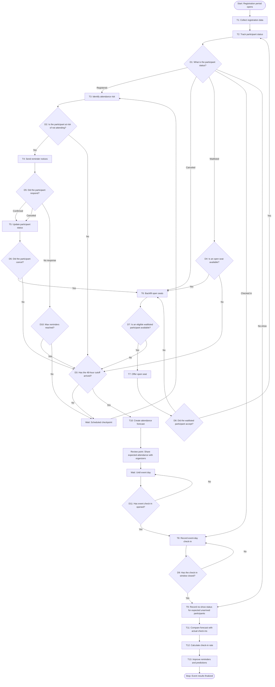

# Workflow of Tasks

*Replace all bracketed prompts with information specific to your proposed system. Delete instructional text that does not belong in your final specification. Add or remove task sections as needed. Every task shown in the general workflow must have a corresponding task specification below.*

## 1. Workflow Overview
### 1.1 Workflow Goal
This workflow supports the system goal defined in `my_first_agent/README.md`.

### 1.2 Workflow Trigger
The workflow is triggered when a participant registers for the hackathon event

### 1.3 Completion Condition at Runtime
The workflow is complete when the post-event attendance analytics are finalized.
### 1.4 General Workflow

The general workflow is to collect registration data, track participant status (registered, no-show, canceled, waitlisted, or checked in), identify attendance risk (flag registrants who have not confirmed, missed deadlines, or shows patterns of not showing), send reminder notices (up to a maximum limit), backfill open seats, create the forecast to estimate attendance, wait until the event day to report event day check-in (record actual arrivals), record no-show status for expected unarrived participants, show organizers the expected vs actual attendance, and finally learn after the event (compare the forecast with actual check-ins, calculate the check-in rate, and use the results to improve predictions before finalizing the current event's results).
### 1.5 Workflow Diagram

